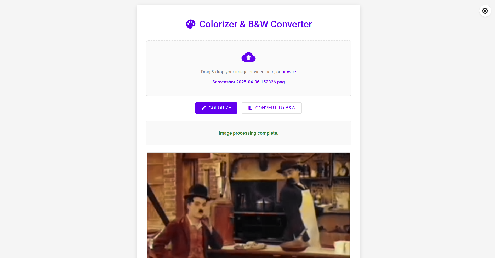
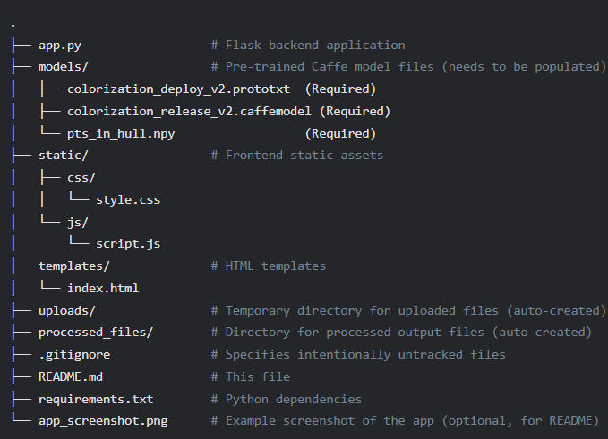

# AI Image & Video Colorizer / B&W Converter

This project provides a web application to automatically colorize black and white images and videos, or convert color media to black and white, using a deep learning model.




## Features

*   **Image Colorization:** Upload a black and white image to get a colorized version.
*   **Video Colorization:** Upload a black and white video to get a colorized version (processed frame by frame).
*   **B&W Conversion:** Convert color images or videos to black and white.
*   **Web Interface:** User-friendly web UI with drag-and-drop file support.
*   **Dark/Light Mode:** Toggle between dark and light themes for comfortable viewing.
*   **OpenCV DNN Model:** Utilizes a pre-trained Caffe model for colorization.

## Project Structure


## Prerequisites

*   Python 3.7+
*   `pip` (Python package installer)
*   Git (for cloning from GitHub)

---

## How to Run This Application

There are two main ways to get the project files:

1.  **Cloning from GitHub (Recommended for easy updates):** Get the latest version directly from the repository.
2.  **Using Local Files (If you downloaded a ZIP or already have them):** If you have the project files from another source.

**Regardless of how you get the files, the "Model Setup" and "Running the Application" steps are the same.**

### Option 1: Cloning from GitHub

1.  **Open your terminal or command prompt.**
2.  **Clone the Repository:**
    Replace `YOUR_USERNAME/YOUR_REPOSITORY_NAME` with the actual GitHub path.
    ```bash
    git clone https://github.com/YOUR_USERNAME/YOUR_REPOSITORY_NAME.git
    ```
3.  **Navigate into the project directory:**
    ```bash
    cd YOUR_REPOSITORY_NAME
    ```
4.  Proceed to the **"Common Setup Steps (After Getting Files)"** section below.

### Option 2: Using Local Files (e.g., from a ZIP download)

1.  **Ensure you have all the project files** (`app.py`, `static/`, `templates/`, `requirements.txt`, etc.) in a single project folder on your computer.
2.  **Open your terminal or command prompt.**
3.  **Navigate into the project directory.**
4.  Proceed to the **"Common Setup Steps (After Getting Files)"** section below.

---

### Common Setup Steps (After Getting Files)

1.  **Create and Activate a Virtual Environment (Highly Recommended):**
    This isolates project dependencies.
    *   **Windows:**
        ```bash
        python -m venv venv
        .\venv\Scripts\activate
        ```
    *   **macOS/Linux:**
        ```bash
        python3 -m venv venv
        source venv/bin/activate
        ```

2.  **Install Dependencies:**
    Ensure you are in the project's root directory where `requirements.txt` is located.
    ```bash
    pip install -r requirements.txt
    ```

3.  **Model Setup (Crucial Step):**
    The colorization model consists of three files that **you need to obtain and place** into the `models/` directory within your project folder. Create the `models/` directory if it doesn't exist.

    *   `colorization_deploy_v2.prototxt`
    *   `colorization_release_v2.caffemodel` (This is usually the largest file)
    *   `pts_in_hull.npy`

    These files are based on the work by Zhang et al. (2016) - "Colorful Image Colorization."
    *   **How to get them:**
        *   Visit the official project page: [https://richzhang.github.io/colorization/](https://richzhang.github.io/colorization/)
        *   Look for download links for the Caffe model.
        *   Specifically, you need:
            *   The `prototxt` deployment file.
            *   The `.caffemodel` weights file.
            *   The `pts_in_hull.npy` file for the quantized color space.
    *   **After downloading, ensure they are placed directly inside the `models/` folder:**
        ```
        YOUR_PROJECT_ROOT/
        └── models/
            ├── colorization_deploy_v2.prototxt
            ├── colorization_release_v2.caffemodel
            └── pts_in_hull.npy
        ```
    **The application will NOT run without these model files correctly placed.**

### Running the Application

1.  **Ensure your virtual environment is activated** (you should see `(venv)` or similar in your terminal prompt).
2.  **Make sure you are in the project's root directory** (where `app.py` is located).
3.  **Run the Flask application:**
    ```bash
    python app.py
    ```
    You should see output indicating the Flask development server is running, typically on port 5000.
    ```
    * Serving Flask app 'app'
    * Debug mode: on
    WARNING: This is a development server. Do not use it in a production deployment.
    Use a production WSGI server instead.
    * Running on http://127.0.0.1:5000
    * Running on http://YOUR_MACHINE_IP:5000 (Press CTRL+C to quit)
    ...
    ```

4.  **Access in Browser:**
    Open your web browser and navigate to:
    *   `http://127.0.0.1:5000/`
    *   Or, if you see another IP address listed (like `http://192.168.1.X:5000/`), you can use that to access it from other devices on your local network.

---

## Usage Guide

1.  **Upload File:** Drag and drop an image or video file onto the designated area, or click "browse" to select a file.
    *   Supported image formats: `.png`, `.jpg`, `.jpeg`
    *   Supported video formats: `.mp4`, `.avi`, `.mov`, `.mkv` (output will always be `.mp4`)
2.  **Choose Action:**
    *   Click "🎨 Colorize" to colorize the uploaded media.
    *   Click "⚫ Convert to B&W" to convert the media to black and white.
3.  **Processing:** A status message and progress bar will indicate that processing is underway. This can take some time, especially for videos.
4.  **View Output:** The processed image or video will be displayed on the page. If a video fails to display, a download link will be provided.
5.  **Theme Toggle:** Click the sun/moon icon in the top-right corner to switch between light and dark modes.

## Technical Details

*   **Backend:** Flask (Python)
*   **Frontend:** HTML, CSS, JavaScript (vanilla)
*   **Colorization Model:** Caffe deep learning model via OpenCV's DNN module.
    *   Based on the work by Zhang et al. (2016).
*   **Image/Video Processing:** OpenCV

## Troubleshooting

*   **"Model files not found" / `FileNotFoundError`:** Ensure the `models/` directory exists in your project root and contains `colorization_deploy_v2.prototxt`, `colorization_release_v2.caffemodel`, and `pts_in_hull.npy`. Double-check filenames.
*   **"No module named 'flask' (or other modules)":** Make sure you have activated your virtual environment and installed dependencies using `pip install -r requirements.txt`.
*   **Video Not Playing in Browser:**
    *   Try a hard refresh (Ctrl+Shift+R or Cmd+Shift+R) or clear your browser's cache for the site.
    *   Check the browser's developer console (usually F12) for errors (Console and Network tabs).
    *   The output video format is MP4 (`mp4v` codec). Ensure your browser supports this. A download link is provided as a fallback.
*   **Large File Uploads/Processing:** The application has a default upload limit (currently 200MB). For larger files, processing will take longer. Long-running processes might time out in a simple development server setup.
*   **"Address already in use" Error on Port 5000:** Another application is using port 5000. Stop the other application or change the port in `app.py` (e.g., `app.run(host='0.0.0.0', port=5001, debug=True)`).

## References

*   Zhang, R., Isola, P., & Efros, A. A. (2016). Colorful Image Colorization. In *European Conference on Computer Vision (ECCV)*.
    *   Project Page: [https://richzhang.github.io/colorization/](https://richzhang.github.io/colorization/)
    *   Paper: [https://arxiv.org/abs/1603.08511](https://arxiv.org/abs/1603.08511)
*   OpenCV (Open Source Computer Vision Library): [https://opencv.org/](https://opencv.org/)
*   Flask Web Framework: [https://flask.palletsprojects.com/](https://flask.palletsprojects.com/)
*   Material Icons: [https://fonts.google.com/icons](https://fonts.google.com/icons)

## Contributing

Contributions are welcome! Please feel free to submit a Pull Request or open an Issue if you find bugs or have ideas for improvements.

## License

This project's code is licensed under the MIT License - see the `LICENSE.md` file for details (if one is provided).
**Important Note:** The Caffe model files (`.caffemodel`, `.prototxt`) and the `pts_in_hull.npy` file have their own licenses, typically for research or non-commercial use. Please verify their original licenses and ensure your usage complies with their terms.
